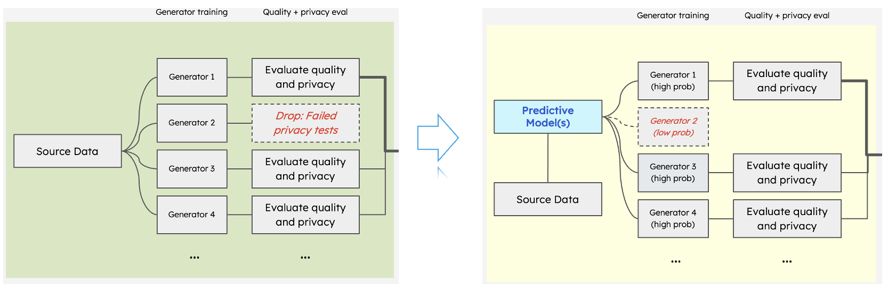
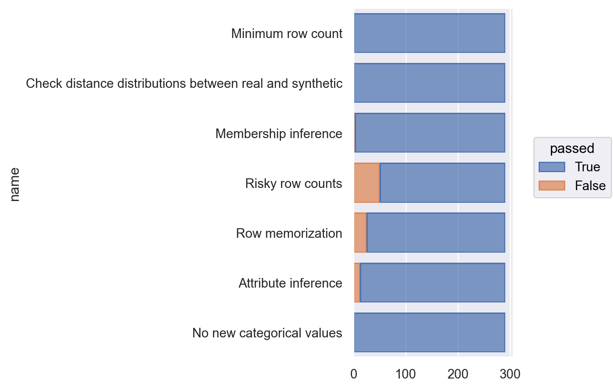
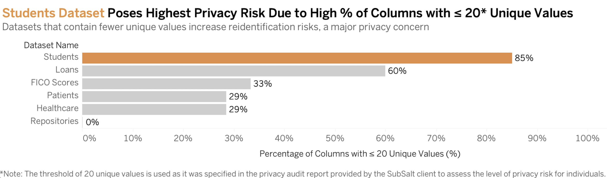
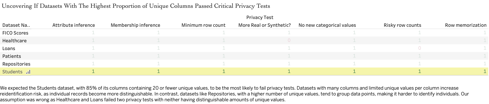
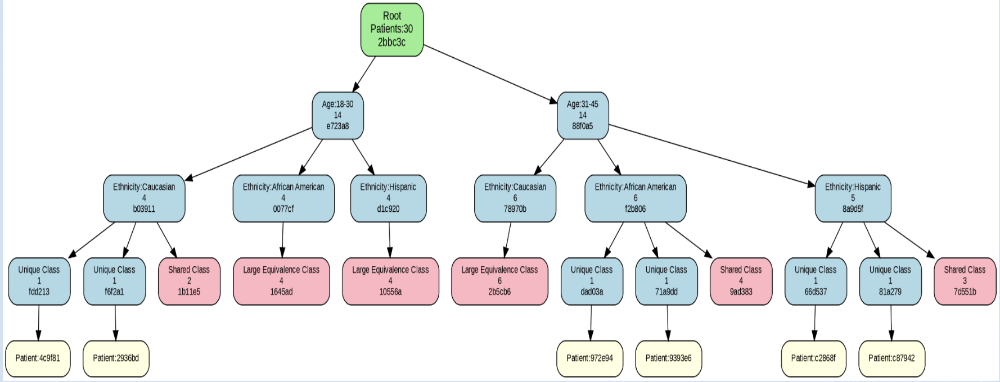

# SubSalt Privacy Compliance Project

Welcome to the **SubSalt Privacy Compliance Project**! This repository details our efforts to build an efficient framework for pre-filtering high-risk data attributes, aimed at enhancing privacy compliance while reducing computational costs.

- [SubSalt Privacy Compliance Project](#subsalt-privacy-compliance-project)
  - [Abstract](#abstract)
  - [Introduction](#introduction)
    - [Context and Overview](#context-and-overview)
  - [The Problem Statement](#the-problem-statement)
  - [Motivation Behind the Project](#motivation-behind-the-project)
  - [Methodology for Early Privacy Risk Detection](#methodology-for-early-privacy-risk-detection)
    - [1. Defining Equivalence Classes for Assessing Privacy Risks](#1-defining-equivalence-classes-for-assessing-privacy-risks)
      - [Defining Equivalence Classes](#defining-equivalence-classes)
    - [2. Building a Decision Tree Framework Using Equivalence Classes](#2-building-a-decision-tree-framework-using-equivalence-classes)
      - [Risk Threshold](#risk-threshold)
    - [3. Scoring Privacy Compliance and Defining Decision Boundaries](#3-scoring-privacy-compliance-and-defining-decision-boundaries)
      - [Compliance Score Equation](#compliance-score-equation)
    - [4. Optimizing Efficiency and Ensuring Regulatory Compliance](#4-optimizing-efficiency-and-ensuring-regulatory-compliance)
    - [5. Approach](#5-approach)
  - [Results](#results)
- [Decision Boundary](#decision-boundary)
  - [Approach:](#approach)
  - [Methodology:](#methodology)
  - [Note:](#note)
  - [How to proceed with building the boundary:](#how-to-proceed-with-building-the-boundary)
  - [Limitations](#limitations)
  - [Future Work](#future-work)
  - [References](#references)
  - [Appendix](#appendix)
    - [How to run the code](#how-to-run-the-code)
    - [Privacy Test overview and breakdown](#privacy-test-overview-and-breakdown)
    - [Model Performance](#model-performance)
    - [Feature Data provided by Subsalt](#feature-data-provided-by-subsalt)
    - [Feature selection](#feature-selection)
    - [Experiments on Privacy Risk Evaluation](#experiments-on-privacy-risk-evaluation)
      - [Experiment 1: Analyzing Privacy Risks Across Different Datasets](#experiment-1-analyzing-privacy-risks-across-different-datasets)
      - [Experiment 2: Analyzing Unique Columns and Assessing Reidentification Risks](#experiment-2-analyzing-unique-columns-and-assessing-reidentification-risks)
      - [Experiment 3: Exploring Decision Tree Performance with Equivalence Classes](#experiment-3-exploring-decision-tree-performance-with-equivalence-classes)
      - [Experiment 4: K fold Cross Validation using logistic regression](#experiment-4-k-fold-cross-validation-using-logistic-regression)

## Abstract

Reducing the expenditure of computational resources while maintaining efficiency and accuracy is an important goal for most organizations. Our project with Subsalt aims to tackle this problem in the context of Subsalt's synthetic data generation pipeline. Our goal is to detect early in the data pipeline, whether or not a synthetically generated dataset is likely to pass privacy tests. The earlier this is detected, the fewer computational resources Subsalt will have have to spend for synthetic data generation. Our approach leverages equivalence classes and decision trees to pinpoint potential vulnerabilities in datasets. In order to achieve this, we run experiments to analyze privacy test results across multiple datasets, unique column analysis for de-identification risk and a conceptual exploration of decision trees and equivalence classes. 

## Introduction

The world is increasingly attuned to the need for data privacy and the protection of sensitive personal information. Organizations and governments worldwide are looking to implement implement stricter regulations and adopting advanced technologies to safeguard individual privacy. This is particularly relevant to organizations that need to use heavily protected medical and financial data to achieve their objectives. For its clients, Subsalt generates synthetic, anonymized data that complies with existing data privacy standards, ensuring entity de-identification and safeguarding sensitive personal information from the client's underlying dataset. It achieves this by running its synthetically generated data through privacy tests. These tests are based on existing privacy regulations such as HIPAA, CCPA and GDPR. 

### Context and Overview

Ensuring privacy in synthetic data generation is both critical and complex, especially in sensitive fields like healthcare. In recent years, researchers have developed various methods to generate synthetic data that upholds privacy standards without sacrificing data utility. One approach to  this is differential privacy, which injects controlled statistical noise into datasets to mask individual-level data while preserving aggregate patterns. While differential privacy effectively balances privacy and utility, its implementation can be computationally intensive and requires careful tuning to maintain data fidelity.

Machine learning techniques such as generative adversarial networks (GANs) and variational autoencoders (VAEs) have been adopted to produce synthetic data closely resembling real-world datasets. GANs, in particular, show promise for creating high-quality synthetic data by pitting a generator model against a discriminator, progressively enhancing the data’s realism. However, while GANs and similar models generate realistic data, they remain vulnerable to privacy risks like data memorization, where actual data points are inadvertently replicated in synthetic outputs.

To mitigate these risks, researchers have introduced privacy tests—such as row memorization and attribute inference risk assessments—into the synthetic data generation pipeline. These tests aim to identify cases where synthetic data closely resembles real records, potentially breaching privacy regulations like HIPAA and GDPR. The ongoing development of such privacy assessment methods highlights the value of early-stage privacy evaluations to optimize computational resources. Pre-assessment techniques, including equivalence class-based testing, enable preliminary risk assessments before more resource-intensive privacy tests are applied, thereby enhancing the efficiency of synthetic data workflows. These approaches are particularly relevant in high-stakes industries where privacy risks are non-negotiable. The ability to predict a dataset’s privacy compliance early can significantly impact resource allocation, ensuring privacy without compromising operational efficiency.

## The Problem Statement

As defined by Subsalt : 
"High computational costs and repetitive privacy testing make large-scale data training slow and costly, reducing the product's value by hindering fast, efficient access to sensitive data."

## Motivation Behind the Project
                       
                                   SUBSALT'S CURRENT DATA GENERATION AND PRIVACY TESTING PIPELINE

                          CURRENT PIPELINE                                                SOLUTION

When a dataset enters Subsalt's data generation pipeline it is fed to multiple models that each generate synthetic datasets. Each of the synthetic datasets are then tested using privacy tests in order to ensure that they are passing , and therefore, usable. This setup is computationally intensive and time-consuming, especially if the synthetic data fails the privacy tests and is rendered unusable. Our project aims to develop a predictive model that can identify, early in the data pipeline, whether synthetic data derived from an uploaded dataset is likely to pass or fail privacy tests—prior to actual data generation. 

Our solution uses the original dataset and its features to predict whether or not the synthetic data will meet the privacy requirements, even before the synthetic data is generated. For this purpose, we focus on the concept of indirect identifiers. Indirect identifiers are those features in the dataset which could potentially cause a re-identification of the entities in the dataset. For instance, geographical area, race, education etc. A careful analysis of patterns associated with the nature and proportion of indirect identifiers in a dataset will enable us to build this predictive model. 

## Methodology for Early Privacy Risk Detection

The SubSalt project utilizes an **equivalence class approach** to streamline privacy testing and improve computational efficiency. By pre-filtering data columns based on privacy risk, we aim to enhance privacy compliance while reducing resource-intensive processing. This methodology employs a decision tree model informed by equivalence classes, guiding data selection to ensure robust privacy protection.

### 1. Defining Equivalence Classes for Assessing Privacy Risks

Equivalence classes group data attributes based on shared privacy characteristics, such as re-identification risk or sensitivity. Each equivalence class \( $E_i$ \) contains attributes \( X \) based on shared characteristics, where a function \( f \) maps each attribute \( x \) to its corresponding risk class \( $c_i$ \). For example, attributes like "Age" and "Zip Code" might be grouped together if they collectively increase re-identification risk.

#### Defining Equivalence Classes

$$
E_i = \{ x \in X \mid f(x) = c_i \}
$$

Here:
- X: Set of all data attributes.
- $E_i$: Equivalence class containing attributes with shared risk characteristics.
- f(x): Function mapping each attribute \( x \) to its corresponding risk class \( $c_i$ \).
- $c_i$: Risk class label for grouping attributes with similar privacy risks.
  

### 2. Building a Decision Tree Framework Using Equivalence Classes

We use a **decision tree model** where equivalence classes serve as decision nodes. Each node assesses the probability P($E_i$ \) of an equivalence class failing privacy tests. If P($E_i$ \) exceeds the risk threshold \( $T_i$ \), the node recommends excluding or modifying the equivalence class.

#### Risk Threshold

$$
P(E_i) = \frac{\text{Number of failing tests in } E_i}{\text{Total tests in } E_i}
$$

### 3. Scoring Privacy Compliance and Defining Decision Boundaries

To assess compliance, we calculate a score \( S(x) \) based on cumulative risks across equivalence classes: where a score threshold \( $S(x)$ \) determines if the data configuration likely meets privacy standards.

#### Compliance Score Equation

$$
S(x) = \frac{\sum_{i=1}^{k} (P(E_i) \cdot \delta(E_i \in x))}{\sum_{i=1}^{k} \delta(E_i \in x)}
$$

### 4. Optimizing Efficiency and Ensuring Regulatory Compliance

By leveraging equivalence classes within a decision tree structure, this methodology enables SubSalt to refine data selection preemptively, minimizing redundant privacy tests. This approach aligns with privacy regulations (e.g., GDPR, HIPAA) by systematically filtering high-risk attributes, ensuring that privacy protocols are followed efficiently.

Implementing this equivalence class-based decision tree model is expected to reduce SubSalt’s computational load, cutting down unnecessary processing cycles and improving alignment with industry privacy standards.

### 5. Approach

The approach taken in this study was structured to identify and evaluate privacy risks inherent in synthetic datasets using a classification-based pipeline. Initially, the problem was framed as a binary classification task, with the aim of predicting whether synthetic build of the training data from dataset would pass or fail a given privacy test.

To facilitate effective modeling, extensive feature engineering was conducted. This included the extraction of statistical features from tabular views, configuration parameters from generative models, and metrics derived from equivalence classes. Both manual and automated feature selection strategies were explored to refine the feature set used in training.

Evaluation metrics were selected with a particular focus on imbalanced data considerations. Balanced accuracy was prioritized, alongside traditional metrics such as overall accuracy, the F0.5 score, specificity (true negative rate), and sensitivity (true positive rate). These metrics provided a comprehensive view of model performance across various privacy tests.

Multiple machine learning algorithms were implemented and compared, allowing complexity vs. intepretability. These included Decision Trees, Random Forests, XGBoost, Logistic Regression, and Support Vector Machines (SVM). Model performance was assessed separately for each type of privacy test, including both row memorization and risky row detection.

## Results

The dataset used for experimentation comprised 291 entries, each evaluated against seven privacy tests, which were categorized into pass or fail outcomes. A total of seven distinct privacy test types were analyzed, revealing varying distributions of pass/fail cases. Four of the the serven distinct privacy test show failing outcomes, specifically, membership inference and attibute inference are rare-failure scenarios, whereas while Memorization and Risky Row Count expose more vulnerabilities, making them useful targets for model training. Each of the five different models we have two set of features, one set is based on the EDA and the other set is based on automated feature engineering.

The results of our experiments are summarized in the following tables, which compare the performance of various models against a Decision Tree baseline. The models were evaluated based on accuracy, F0.5 score, specificity (true negative rate), and sensitivity (true positive rate). We defined a "good" model as those that achieved an accuracy of 0.8 or higher. Among the "good" models, we identified the best-performing ones based on the F0.5 score, which is can minimize false positives while maximizing true positives. We also included the Decision Tree model as a baseline for comparison. 

Table 1: Risky Row Count Best Performing Models vs. Decision Tree Baseline
| Model                     | Accuracy | F0.5 Score | Specificity (TNR) | Sensitivity (TPR) |
|---------------------------|----------|------------|-------------------|-------------------|
| **Logistic Regression**   | 0.83     | 0.95       | 1.00              | 0.79              |
| Decision Tree (Baseline)  | 0.74     | 0.84       | 0.42              | 0.82              |

For the risky row count test, Logistic Regression emerged as the most effective model. It achieved an accuracy of 0.83 and an F0.5 score of 0.95. Notably, it demonstrated perfect specificity (1.00), indicating its exceptional ability to correctly identify failing rows, while maintaining a strong sensitivity (0.79). In contrast, the Decision Tree, used as a baseline, achieved lower overall accuracy (0.74) and specificity (0.42) but performed marginally better in detecting true positives (sensitivity of 0.82).

Table 2: Row Memorization Best Performing Models vs. Decision Tree Baseline
| Model                                 | Accuracy | F0.5 Score | Specificity (TNR) | Sensitivity (TPR) |
|---------------------------------------|----------|------------|-------------------|-------------------|
| **XGBoost / SVM / Logistic Regression** | 0.93     | 0.98       | 1.00              | 0.92              |
| Decision Tree (Baseline)              | 0.58     | 0.85       | 0.75              | 0.56              |

In the row memorization test, XGBoost, SVM, and Logistic Regression all performed at a high level, each achieving an accuracy of 0.93 or higher, with an F0.5 score of 0.98 and perfect specificity. These models effectively identified memorized rows, with minimal false positives. The Decision Tree model, however, underperformed in this context, with an accuracy of only 0.58 and a sensitivity of 0.56.

These results indicate that advanced classifiers, particularly ensemble and regularized linear models, offer superior performance in detecting privacy risks within synthetic data when compared to simpler tree-based baselines.

# Decision Boundary 

Conceptualizing the decision boundary in the context of this project involved experimenting with different models and approaches to identify data points that are very close to the decision boundary. These are points where the model struggles with making an accurate prediction of pass or fail. This boundary also helps us identify thresholds at which the model becomes more confident in its predictions, which could potentially guide us in deciding which columns should be removed from the dataset to increase the likelihood of passing.

## Approach:

When we plot the boundary using different combinations of features, we observe that some points are far from the boundary, while others are close. The distance from the boundary indicates how confident the prediction model is that the dataset will pass if only the selected features are considered. First, the accuracy of our prediction model needs to be high and optimized to extract reliable insights from the decision boundary. Points that are very close to the boundary are the ones that cause the model to struggle with predicting pass or fail.

Since the columns removed to increase the likelihood of passing tend to be indirect indicators (which make up equivalence classes), we used the average equivalence class size as one of the features for the decision boundary. Some points were close to the boundary, while others were far. This can potentially help us identify the average equivalence class threshold, beyond which the model can confidently determine whether a dataset is likely to pass or fail. That threshold can make it easier to know how many or which columns need to be removed so that the average equivalence class size for the dataset reaches a value at which the model strongly predicts a pass.

## Methodology:

It was found that non-linear models, such as XGBoost, performed better than linear regression and linear SVM. SVM with the RBF kernel seems to be easier to interpret and also provides a metric to detect the distance from the boundary – the signed distance. We used a probability threshold of 0.5 (when a point appears on the boundary, it means the model is uncertain, with a 50/50 chance of pass or fail. The further a point moves in a certain direction, the higher the model's confidence in predicting pass or fail).

| Metric                                 | Average Distance to Boundary |
|----------------------------------------|------------------------------|
| **PASS Points**                        | 2.22                         |
| **FAIL Points**                        | 1.77                         |

It was observed that the passing points were, on average, 2.22 standard deviations away from the boundary, while the fail points were, on average, 1.77 standard deviations away. This is likely due to there being more passes than fails in the dataset. Considering these two averages, we set a distance of 1 to visualize the points that were very close to the boundary.

## Note:

It appears that many of the points close to the boundary appear at a value of zero on the y-axis (average equivalence class size variable). This can be explained by the fact that the StandardScaler function was used to standardize the values on the x and y axes. This means the features have a mean of 0. Therefore, points that appear at or close to 0 are those that are very close to the average for that feature in the dataset.

## How to proceed with building the boundary:

A larger dataset with more fails will provide better insights.

Experimenting with the probability threshold for the decision boundary (e.g., 0.5, 0.6, 0.8, etc.).

Trying different thresholds for the signed distance in the context of points "very close" to the boundary (e.g., 1, 0.8, 0.9, etc.).

## Limitations

Several limitations were encountered during the study. First, the dataset exhibited class imbalance, with a disproportionate number of passing versus failing instances across most privacy tests. Although this was partially addressed through balanced accuracy metrics and class weighting, the skew may still influence model generalizability.

Potential data leakage was another concern, mitigated by ensuring that the training and test splits were conducted at the dataset level, rather than at the row level. This was essential to prevent overfitting to shared structures or artifacts in the data.

Feature engineering posed additional challenges due to the latent complexity of certain attributes and their interactions. Equivalence class-based predictors were particularly sensitive to small input variations, which introduced instability in the decision boundary of some models.

Lastly, a trade-off between model interpretability and predictive performance was evident. While interpretable models like Decision Trees offered greater transparency, they often underperformed in accuracy and recall compared to more complex models. Furthermore, the absence of real-world production or historical data limited the validation of models to public datasets, which may not fully capture the intricacies of operational privacy risks.

## Future Work

Future directions for this work include deeper integration of interpretability techniques such as SHAP (SHapley Additive exPlanations) to elucidate the decision-making processes of high-performing, black-box models. This would enhance trust and facilitate model auditing in sensitive applications.

Expanding the dataset is another priority. By deliberately generating additional failure cases—especially near the decision boundary—it may be possible to improve the robustness and generalization of the models. Incorporating more diverse and representative datasets will also help mitigate biases introduced by a narrow training corpus.

The framework could also be extended to include new or evolving privacy tests, particularly as patterns of data leakage continue to shift with changes in synthetic data generation practices.

Finally, the deployment of these models in a controlled, pre-production environment will be essential to validate their effectiveness under real-world constraints. This stage will help assess the practicality of integrating automated privacy risk detection into data pipelines used in enterprise or research contexts.

## References
* [Harnessing the power of synthetic data in healthcare: innovation, application, and privacy](https://www.nature.com/articles/s41746-023-00927-3)
* [Machine Learning for Synthetic Data Generation: A Review](https://arxiv.org/pdf/2302.04062)
* [Challenges of Using Synthetic Data Generation Methods for Tabular Microdata](https://www.mdpi.com/2076-3417/14/14/5975)
* [HIPAA COMPLIANCE:
SYNTHETIC DATA PRIVACY ASSESSMENT REPORT](docs/SUB22DP1b_DRAFT.pdf)

## Appendix

### How to run the code
1. All the code for different models are in the `notebooks > models` folder. The code is organized into different notebooks for each model.
* `dt_fix.ipynb` - Decision Tree
* `lr_fix.ipynb` - Logistic Regression
* `rf_fix.ipynb` - Random Forest
* `xgb_fix.ipynb` - XGBoost
* `svm_fix.ipynb` - SVM
2. The code for automated feature engineering is in the `notebooks > models` folder. 
* `featurewiz_fix.ipynb` - Automated Feature Engineering
3. The code for performance evaluation is in the `notebooks > models` folder.
* `perf_analysis.ipynb` - Performance Evaluation
4. The code for base model analysis in the `notebooks > models` folder.
* `portal_metrics.ipynb` - Base Model analysis
5. The code for generating the equivalence class metrics is in the `notebooks > models` folder.
* `data-connector_fix.py` - Equivalence Class Metrics
6. The json payload for privacy test is in the `notebooks > models` folder.
* `0320.json` - Privacy Test Payload
7. The dataset used for testing is in the `notebooks > models` folder.
* `test_set.txt` - Dataset used for testing
8. All modle performance results are in the `notebooks > models > result` folder.
9. The manual and automated feature selection is in the `notebooks > models` folder.
* `PRIVACY_Risky row counts_selected_features_fw_all.txt` - Automated Feature Selection
* `PRIVACY_Risky row counts_selected_features_fw.txt` - Top 4 automated Feature Selection
* `PRIVACY_Risky row counts_selected_features_man.txt` - Manual Feature Selection
* `PRIVACY_Row memorization_selected_features_fw_all.txt` - Automated Feature Selection
* `PRIVACY_Row memorization_selected_features_fw.txt` - Top 4 automated Feature Selection 
* `PRIVACY_Row memorization_selected_features_man.txt` - Manual Feature Selection

### Privacy Test overview and breakdown
* 

### Model Performance

### Feature Data provided by Subsalt
* [Data Dictionary](<data/MIDS _ Subsalt - inputs & outputs.xlsx>)

### Feature selection
* Automated selected features for Risky Row Count:
pct_indirect_ids,
cap_row_count,
avg_unique_values,
std_equivalence_class_size
* Manual selected features for Risky Row Count:
num_rows_in_small_equivalence_classes,
r_iids_categorical,
ec_entropy,
num_small_equivalence_classes
* Automated selected features for Row Memorization:
pct_indirect_ids,
std_equivalence_class_size,
cap_row_count,
avg_indirect_id_unique_values
* Manual selected features for Row Memorization:
avg_equivalence_class_size,
pct_indirect_ids,
avg_unique_values,
num_equivalence_classes

### Experiments on Privacy Risk Evaluation

In this section, we outline our preliminary experiments based on the exploratory data analysis (EDA) and the foundational analysis conducted with the SubSalt dataset. These experiments help us understand the privacy compliance risks and explore potential solutions for implementing an equivalence class-based decision tree model to improve efficiency. Each experiment builds on the methodology outlined in the project and is documented in detail within the analysis notebooks.

#### Experiment 1: Analyzing Privacy Risks Across Different Datasets

**Objective**: Assess privacy compliance risks across different datasets to identify attributes prone to privacy test failures.

- **Description**: We applied critical privacy tests to various datasets, such as "FICO Scores," "Healthcare," "Loans," "Patients," "Repositories," and "Students." These tests included:
  - Attribute Inference
  - Membership Inference
  - Minimum Row Count
  - Risky Row Counts
- **Findings**: The "Students" dataset displayed the highest privacy risk, with 85% of its columns containing 20 or fewer unique values, increasing the chance of re-identification due to greater data specificity.

  **Related Notebook**: [Data Exploration and Privacy Test Notebook](https://github.com/subsalt/mids/blob/sample_data/notebooks/privacy_test_analysis.ipynb)  
  **Related Visualization**:

#### Experiment 2: Analyzing Unique Columns and Assessing Reidentification Risks

**Objective**: Analyze how the number of unique values in columns affects re-identification risk, influencing whether a dataset passes privacy compliance tests.

- **Description**: For each dataset, we calculated the proportion of columns with 20 or fewer unique values. Datasets with a high proportion of limited-uniqueness columns are at a greater risk for re-identification and therefore more likely to fail privacy tests.
- **Findings**: Datasets with a greater proportion of unique values per column, like "FICO Scores" and "Loans," had lower risks, whereas the "Students" dataset faced higher re-identification risks.

  **Related Notebook**: [Unique Column Analysis Notebook](https://github.com/subsalt/mids/blob/sample_data/sample/data_viz_and_eda_cont.ipynb)  
  **Related Visualization**:
  

#### Experiment 3: Exploring Decision Tree Performance with Equivalence Classes 

**Objective**: Explore the potential for a decision tree model that uses equivalence classes to pre-filter high-risk data attributes, reducing the need for redundant privacy testing.

- **Description**: Although not yet implemented, this experiment outlines the theoretical use of equivalence classes as decision nodes in a tree structure, allowing for early categorization of privacy-sensitive attributes. This approach could streamline privacy testing by filtering high-risk columns before intensive testing phases.
- **Projected Benefits**: Implementing an equivalence class-based decision tree model is expected to improve efficiency by minimizing the computational load, as non-compliant data can be filtered early in the process.

  **Related Notebook**: [Conceptual Decision Tree and Equivalence Class Notebook](https://github.com/subsalt/mids/blob/sample_data/concepts/Equivalence%20Trees.ipynb)  
  **Related Visualization**: 
  
 
#### Experiment 4: K fold Cross Validation using logistic regression
**Objective**: To evaluate the performance of the logistic regression model on the dataset

- **Description**: We used the logistic regression model to predict the privacy compliance of the dataset. Due to the dataset size being small, we used the K=5 fold cross validation technique to evaluate the performance of the model. The model was trained on the dataset and the accuracy, F1 score, PR-AUC of the model was calculated.
- **Findings**: The model performed well on the dataset with an mean accuracy of 0.83, F1 score of 0.91 and PR-AUC of 0.84 for Rick Row Counts test; mean accuracy of 0.89, F1 score of 0.94 and PR-AUC of 0.90 for Rick Row memorization test.

  **Related Notebook**: [K fold Cross Validation Notebook](notebooks/LR_model_kfold.ipynb)

These preliminary experiments provide valuable insights into the potential of an equivalence class-based approach to optimize privacy compliance testing at SubSalt. As we continue developing this project, the experiments will evolve to refine the model and improve computational efficiency.

